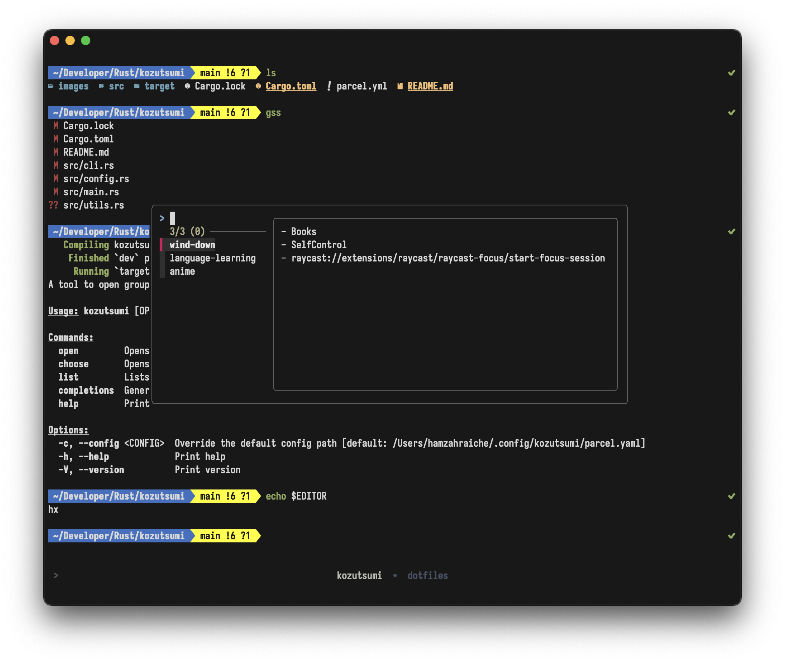

<!--
- [ ] ability to both open and close the parcels
- [x] ability to open true path
- [/] raycast extension baby (done thru deep links)
- [ ] ability to open/close multiple parcels at once
- [ ] add shell command support (only runs if some env var is set for extra safety)
- [ ] add ability to templateize paths (e.g. `obsdian://open?file=Journal/{{today's date}}`)
  - [ ] the template should be customizable (e.g. `{{date:YYYY-MM-DD}}` or `{{date:DD-MM-YYYY}}`), through the templating crate maybe
-->

# Kozutsumi
Open and close parcels from your terminal.

## Installation

### Homebrew
```sh
brew tap fruit-bird/kozutsumi
brew install kozutsumi
```

Install with additional features:
```sh
brew install kozutsumi --with-json --with-dialoguer
```

### Cargo
```sh
cargo install kozutsumi [--features=json,dialoguer]
```

### Nix
In your flake configuration:
```nix
{ pkgs, ... }: {
  environment.systemPackages = with pkgs; [
    kozutsumi
  ];
}
```
Or install directly with nix-env:
```sh
nix-env -iA nixpkgs.kozutsumi
```

## Usage
```
Usage: kozutsumi [OPTIONS] <COMMAND>

Commands:
  open         Opens a parcel by name
  choose       Opens a parcel by choosing from a list
  list         Lists all available parcels
  completions  Generate shell completions

Options:
  -c, --config <CONFIG>  Override the default config path
```

### Configuration File
You first create a config file at `~/.config/kozutsumi/parcel.yaml` with the following structure:

```yml
anime:
  - Sequel
  - IINA
  - fs:~/Movies/Anime
language-learning:
  - obsidian://open?file=path/to/language-notes-file
  - Anki
  - https://www.duolingo.com
```

Then you can open a parcel by running:
```sh
kozutsumi open language-learning
```

### Chooser
You can also use a chooser to select the parcel to open:
```sh
kozutsumi choose --chooser=fzf --multi
```

Deep links / URIs are also supported:
```yml
deeplinks:
  - raycast://confetti
  - x-apple.systempreferences:com.apple.preference.displays
  - raycast://extensions/raycast/raycast-focus/start-focus-session
  - spotify://track/0vH25LloTmsmsh5uCuj0JC
```

> This feature requires `fzf` to be installed.

### Tmux Integration
If you use `kozutsumi` through `tmux`, the chooser will open in a small overlay. You can combine this with a keybinding to allow for easier opening of parcels.

Here is an example tmux keybinding to open the chooser with `prefix+o`:
```sh
bind 'o' run-shell "sh -lc 'kozutsumi choose --multi --chooser=fzf'"
```


